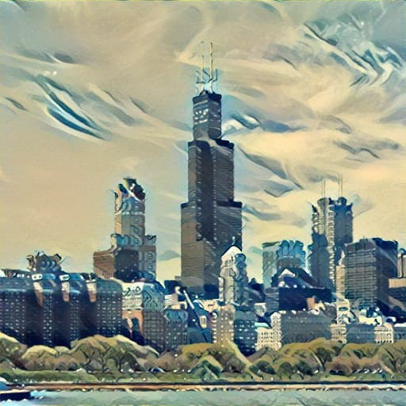
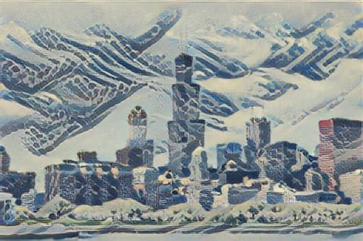
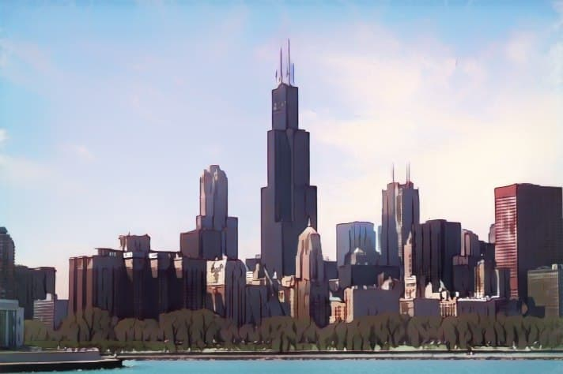

# Краткое описание
Это телеграм бот для работы с изображениями.

Главной его задачей является преобразование исходной картинки под какой-то стиль, который пришлёт пользователь.
Либо в уже подготовленный, если используется модель GAN. Стилем может быть любая картинка. 
            
- Модели NeuralStyleTransfer и FastNeuralStyleTransfer делают перенос пользовательского стиля на изображение, которое так же загрузил пользователь.

- Модель CycleGAN не использует стиль загруженный пользователем, а преобразует исходную картинку в мультяшную.

# Примеры

Посмотреть пример работы можно здесь: [демо-видео работы бота](https://drive.google.com/file/d/1JW_x6kkFAypa_uq2VyU71ogRjLyb7UtH/view?usp=share_link)

Контент: 

Стиль: 

- Модель NeuralStyleTransfer. Результат:

    

- Модель FastNeuralStyleTransfer. Результат:

    

- Модель CycleGAN. Результат:

    

  

# Команды бота
    /help  -  Получить краткое описание бота
    /start  -  Начать взаимодействие с ботом
    /reset  -  Сбросить текущее состояние бота и начать сначала

# Ожидаемое поведение бота и пользователя
    1. Пользователь видит сообщение от бота, который просит прислать ему изображение, к котором будет применён стиль
    2. Пользователь присылает картинку боту.
    3. Пользователь видит две кнопки с выбором модели:
      3.1. Пользователь выбирает GAN:
        - Бот применяет модель GAN, это занимает несколько секунд.
        - Пользователь получает ответ от бота с преобразованным изображением.
        - Переход к пункту 4.
      3.2. Пользователь выбирает NST:
        - Бот просит пользователя загрузить стиль. Стилем может быть любая картинка.
        - Пользователь присылает картинку боту.
        - Пользователь видит две кнопки с выбором модели NST:
          -- Пользователь выбирает "Медленно":
            --- Бот применяет модель NST, это может занять до 20 минут.
            --- Gользователь получает ответ от бота с преобразованным изображением.
            --- Переход к пункту 4.
          -- Пользователь выбирает "Быстро":
            --- Бот применяет модель FastNST, это занимает несколько секунд.
            --- Gользователь получает ответ от бота с преобразованным изображением.
            --- Переход к пункту 4.
    4. Появляется кнопка "Начать сначала", нажав на которую пользователь переходит к началу (пункт 1.)   
    
    * В любой момент пользователь может запросить краткое описание /help или перейти к началу /reset
    /reset не рекомендуется делать во время ожидания результата от бота.
